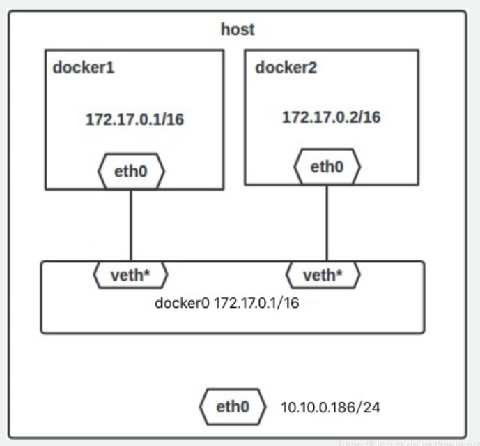

### 一、Docker网络
&ensp;&ensp;&ensp;&ensp;安装Docker时，它会自动创建三个网络：bridge、none和host。
|  网络简介   | 介绍  |
|  :----  | :----  |
| Host  | 容器将不会虚拟出自己的网卡，配置自己的IP等，而是使用宿主机的IP和端口 |
| Bridge  | 此模式会为每个容器分配、设置IP等，并将容器连接到一个docker0的虚拟网桥，通过docker0网桥以及IPTables nat表配置与宿主机通信 |
| None  | 此模式关闭了容器的网络功能 |
| Container  | 创建的容器不会创建自己的网卡、配置自己的IP，而是和一个指定的容器共享IP、端口范围 |
| 自定义网络  | 略 |

### 二、默认网络
&ensp;&ensp;&ensp;&ensp;安装Docker时，它会自动创建三个网络，可以使用docker network ls查看。
```sh
```
&ensp;&ensp;&ensp;&ensp;Docker内置这三个网络，在运行容器时，可以使用--network参数指定容器连接到哪些网络。bridge网络默认代表Docker安装时创建的docker0网络，除非使用docker run --network=***指定，否则Docker守护进程默认将容器连接到此网络。

&ensp;&ensp;&ensp;&ensp;在docker run创建Docker容器时，可以使用--net选项指定容器的网络模式，Docker有4种网络模式：

- host模式：--net=host
- none模式: --net=none
- bridge模式: --net=bridge
- container模式: --net=container:NAME_or_ID
### 三、Host模式
&ensp;&ensp;&ensp;&ensp;Docker使用了Linux的Namespaces技术来进行资源隔离，如PID Namespaces进程隔离、Mount Namespaces隔离文件系统、Network Namespaces隔离网络等。
&ensp;&ensp;&ensp;&ensp;此网络模式下，容器与宿主机在同一网络中，没有独立的IP。一个Network Namespace提供了一份独立的网络环境，包括网卡、路由、iptable规则等都与其他Network Namespace隔离。一个Docekr容器一般会分配一个独立的Network Namespace。如果启动容器时使用Host模式，那么这个容器将不会获得要给独立的Network Namespace，而是和宿主机公用一个Network Namespace。容器将不会虚拟出自己的网卡，配置自己的IP等，而是使用宿主机的IP和端口。
### 四、Bridge模式
#### 4.1、Bridge模式的拓扑
&ensp;&ensp;&ensp;&ensp;当Docker Server启动时，会在机器上创建一个名为docker0的虚拟网桥，此主机上启动的Docker容器会连接到这个虚拟网桥上。
&ensp;&ensp;&ensp;&ensp;虚拟网桥的工作原理和物理交换机类似，主机上的所有容器都通过交换机连在一个二层网络中。接下来就要为容器分配IP，Docker会从RFC1918所定义的私有IP网段中，选择一个和宿主机不同的IP地址和子网分配给docker0，连接到docker0的容器就从这个子网中选择一个未占用的IP使用。

#### 4.2、网络模式详解
&ensp;&ensp;&ensp;&ensp;Docker完成以上网络配置的过程大致是这样的：

- 在主机上创建一对虚拟网卡veth pair设备，veth设备（通常用来连接两个网络设备）总是成对出现的，它们组成了一个数据通道，数据从一个设备进入，就会从另一个设备处理。
- Docker将veth pair设备的一端放在新建的容器中，并命名为eth0；另一端放在主机中，以veth65f9这样类似的名字命名，并将这个网络设备加入到docker0网桥中，可以通过`brctl show`命令查看。
```sh
```
- 从docker0子网中分配一个IP给容器使用，并设置docker0的IP地址为容器的默认网关。
#### 4.3、bridge模式下容器通信

### 五、Container模式


https://www.cnblogs.com/hahaha111122222/p/13370773.html