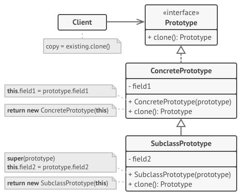

### 一、意图
&ensp;&ensp;&ensp;&ensp;**原型模式**是一种创建型模式，使你能够复制已有对象，而又无需使代码依赖它们所属的类。
### 二、问题
&ensp;&ensp;&ensp;&ensp;如果有一个对象，并希望生成并与其完全相同的复制品，该如何实现呢？

&ensp;&ensp;&ensp;&ensp;首先，必须新建一个属于相同类的对象。然后，必须遍历原始对象的所有成员变量，并将成员变量值复制到新对象中。

&ensp;&ensp;&ensp;&ensp;直接复制存在问题，首先，并非所有对象都能通过这种方式进行复制，因为有些对象可能拥有私有成员变量，它们在对象本身之外是不可见的。然后，复制一个变量，需要知道对象所属的类才能创建复制品，所以代码必须依赖该类。
### 三、解决方法
&ensp;&ensp;&ensp;&ensp;原型模式将克隆过程委派给被克隆的实际对象。模式为所有支持克隆的对象声明了一个通用接口，该接口能够克隆对象，同时又无需将代码和对象所属类耦合。通常情况下，这样的接口中仅包含一个`克隆`方法。

&ensp;&ensp;&ensp;&ensp;所有类的`克隆`方法的实现都非常相似。该方法会创建一个当前类的对象，然后将原始对象所有成员变量值复制到新建类对象中（几乎所有语言都允许对象访问其同类对象的私有成员变量）。

&ensp;&ensp;&ensp;&ensp;
### 四、原型模式结构
- Prototype：原型接口将对克隆方法进行声明。在绝大多数情况下，其中只会有一个名为Clone的方法
- ConcretePrototype：具体原型类将实现Clone方法，除了将原始对象的数据复制到克隆体中之外，该方法有时还需要处理克隆过程中的极端情况，例如克隆关联对象和梳理递归依赖等。
- Client：可以复制实现了原型接口的任何对象

### 五、适用场景
- 如果你需要复制一个对象，同时希望代码独立于这些所属的具体类，可以使用原型模式

&ensp;&ensp;&ensp;&ensp;&ensp;&ensp;代码需要处理第三方代码通过接口传递过来的对象时。 即使不考虑代码耦合的情况， 你的代码也不能依赖这些对象所属的具体类， 因为你不知道它们的具体信息。
- 如果子类的区别仅在于其对象的初始化方式，那么可以使用该模式来减少子类的数量。别人创建这些子类的目的可能是为了创建特定类型的对象
### 六、实现方式
- 创建原型接口，并在其中声明`Clone`方法，如果你已有类层次结构，则只需在其所有类中添加该方法即可。
- 原型类必须另行定义一个以该类对象的构造函数。构造函数必须复制参数对象中的所有成员变量值到新建实体中
- 克隆方法通常比较简单，使用new运算符调用原型版本的构造函数。注意，每个类都必须显示重写克隆方法并使用自身类名调用new运算符。否则，克隆方法可能会生成父类对象。
### 七、优缺点
- 优点
  - 可以克隆对象， 而无需与它们所属的具体类相耦合
  - 可以克隆预生成原型， 避免反复运行初始化代码
  - 可以更方便地生成复杂对象
  - 可以用继承以外的方式来处理复杂对象的不同配置
- 缺点
  - 克隆包含循环引用的复杂对象可能会非常麻烦