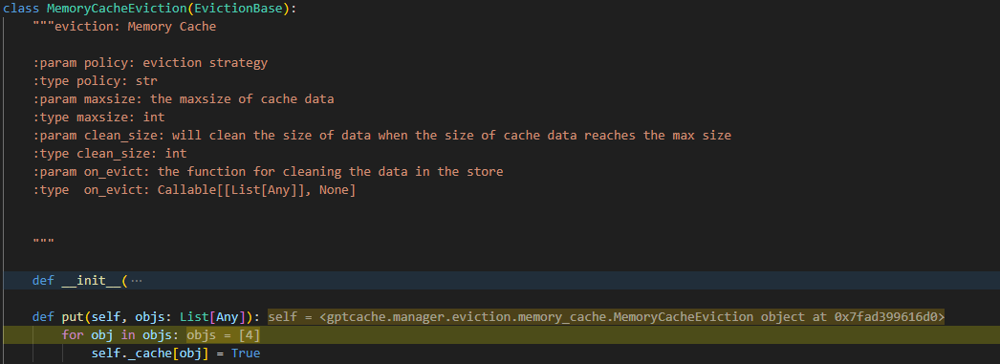

### 一、语义匹配原理

### 二、语义匹配涉及技术

### 三、GPTCache原理
&ensp;&ensp;&ensp;&ensp;GPTCache利用在线服务的数据局部性特点，存储常用数据，降低检索时间，减轻后端服务器负载。与传统缓存系统不同，GPTCache进行语义缓存，识别存储相似或相关的查询以提高命中率。

&ensp;&ensp;&ensp;&ensp;GPTCache Adapter大语言模型适配器将大语言模型请求转换为缓存协议，并将缓存结果转为LLm响应。适配器目前支持api调用（put、get）、langchain、OpenAI等。以下内容以api调用为例：
#### 3.1、精准匹配缓存
##### 3.1.1、数据容器
&ensp;&ensp;&ensp;&ensp;精确匹配数据存储使用MAPDataManager，通过参数data_path、max_size和get_data_container参数来管理数据。

1、初始化
&ensp;&ensp;&ensp;&ensp;使用cachetools.LRUCache，初始化时通过pickle.load方法将缓存文件中的内容读出。

2、查找

3、保存

##### 3.1.2、初始化
1、参数
- cache_enable_func：函数用来给出是否启用缓存，默认时cache_all
- pre_embedding_func：提取特征向量之前的预处理，必须设置为get_prompt
- embedding_func：提取文本特征向量的方法
- data_manager：缓存管理的DataManager
- similarity_evaluation：缓存命中后的评估方法
- post_process_messages_func：后处理，默认是temperature_softmax
- config：配置文件
- next_cache：

2、流程

##### 3.1.3、put
1、参数
- prompt：缓存key
- data：缓存value
- kwargs：其他未定义的参数

2、流程
- pre_embedding_func提取特征向量之前的预处理，精准匹配缓存使用get_prompt，获取用户cache key

- embedding_func提取文本特征向量，精确匹配缓存使用string_embedding，获取用户embedding vector

- 模拟llm请求

- 缓存保存并刷新文件

##### 3.1.4、get

#### 3.2、语义匹配缓存
##### 3.2.1、数据容器
&ensp;&ensp;&ensp;&ensp;语义匹配数据存储使用SSDataManager，通过参数cache_base、vector_base、max_size、clean_size、eviction参数类管理数据。
##### 3.2.1、初始化
1、参数
- data_dir：数据存储路径
- cache_obj：Cache Object
- pre_func：提取特征向量之前的预处理函数，默认为get_prompt
- embedding：embedding对象，默认是Onnx模型(GPTCache/paraphrase-albert-onnx)
- data_manager：缓存管理的DataManager，默认是sqlite,faiss
- evaluation
- post_func
- config

2、流程
- 总体流程

- 加载embedding模型

- 获取DataManager
&ensp;&ensp;&ensp;&ensp;根据用户选择的Cache Storage和Vector Storage参数初始化Cache Storage和Vector Storage。

- Cache Storage初始化

- Vector Storage初始化

- 清除数据策略

- 根据Cache Storage、Vector Storage、清楚策略获取Data Manager

- 相似度评估器

- 根据Data Manager、清除策略和相似度评估器初始化Cache Object

##### 3.2.2、put
1、参数
- prompt：the cache data key，str
- data：the cache data value, Any
- cache_obj：the cache object

2、流程
- 总体流程

- pre_embedding_func提取特征向量之前的预处理，语义匹配缓存默认使用get_prompt，获取用户cache key

- embedding_func提取文本特征向量，语义匹配缓存默认使用Onnx.to_embeddings，获取用户embedding vector

- 模拟llm请求(对于api请求，cache value是用户指定的值，因此无需真正请求llm，使用自定义方法`llm_handler`代替llm请求)

- 缓存保存并刷新文件

首先将question与question的embedding插入到sqlite中；然后将answer与question插入的id插入到sqlite中。

将question的embedding和question插入Cache Storage中的id插入到向量数据库中

将question插入Cache Storage中的id插入到清除数据存储中。

缓存刷新

Sqlite无需刷新；faiss需要刷新

##### 3.2.3、get
1、参数
- prompt：the cache data key，str
- cache_obj：the cache object
- top_k：返回个数

2、流程

- pre_process：流程与put一样
- embeeding：流程与put一样
- search流程

查找top_k条数据

对于top_k条数据，逐条查询其cache value

在真实使用的Cache Storage中查询cache value

对cache value进行相似度评估

- post_process：

