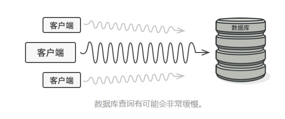

### 一、意图
&ensp;&ensp;&ensp;&ensp;**代理模式**是一种结构型设计模式，能够提供对象的替代品或占位符。代理控制着对于原对象的访问，并允许在将请求提交给对象前后进行一些处理。

### 二、问题
&ensp;&ensp;&ensp;&ensp;为什么要控制对于某个对象的访问呢？例如，有这样一个消耗大量系统资源的巨型对象，只是在偶尔需要使用它，并非总需要。

&ensp;&ensp;&ensp;&ensp;可以实现延迟实例化：在实际有需要时再创建该对象。对象的所有客户端都要执行延迟初始代码。

### 三、解决方案
&ensp;&ensp;&ensp;&ensp;代理模式建议新建一个与原服务对象接口相同的代理类，然后更新应用以将代理对象传递给所有原始对象客户端。代理类接收到客户端请求后会创建实际的服务对象，并将所有工作委派给它。

&ensp;&ensp;&ensp;&ensp;这样的好处是：如果需要在类的主要业务逻辑前后执行一些工作，无需修改类就能完成这项工作。由于代理实现的接口与原类相同，因此可将其传递给任何一个使用实际服务对象的客户端。

### 四、代理模式结构

### 五、应用场景
- 延迟初始化（虚拟代理）
&ensp;&ensp;&ensp;&ensp;如果有一个偶尔使用的重量级服务对象，一直保持该对象运行会消耗系统资源时，可使用代理模式。
&ensp;&ensp;&ensp;&ensp;代理模式无需在启动时创建对象，可将对象的初始化延迟到真正需要的时候。

- 访问控制（保护代理）
&ensp;&ensp;&ensp;&ensp;如果只希望特定客户端使用服务对象，这里的对象可以是操作系统中的非常重要的部分，而客户端则是各种已启动的程序，此时可使用代理模式。
&ensp;&ensp;&ensp;&ensp;代理可仅在客户端凭据满足时将请求传递给服务对象。

- 本地执行远程服务（远程代理）
&ensp;&ensp;&ensp;&ensp;适用于服务对象位于远程服务器上的情形。
&ensp;&ensp;&ensp;&ensp;在这种情况下，代理通过网络传递客户端请求，负责处理所有与网络相关的复杂细节。

- 记录日志请求（日志记录代理）
&ensp;&ensp;&ensp;&ensp;适用于当你需要保存对于服务对象的请求历史记录时。
&ensp;&ensp;&ensp;&ensp;代理可以在想服务传递请求前进行记录。

- 缓存请求代理（缓存代理）
&ensp;&ensp;&ensp;&ensp;适用于需要缓存客户请求结果并对缓存生命周期进行管理时，特别是当返回结果的体积非常大时。
&ensp;&ensp;&ensp;&ensp;代理可对重复请求所需的相同结构进行缓存，还可以进行请求参数作为索引缓存的键值。

- 智能引用
&ensp;&ensp;&ensp;&ensp;可在没有客户端使用某个重量级对象时立即销毁对象。
&ensp;&ensp;&ensp;&ensp;代理会将所有获取了执行服务对象或其结果的客户端记录在案。代理会时不时地遍历各个客户端，检查它们是否仍在运行。如果相应的客户端列表为空时，代理会销毁该服务对象，释放底层系统资源。
&ensp;&ensp;&ensp;&ensp;代理还可以记录客户端是否修改了服务对象。其他客户端还可以复用未修改的对象。

### 六、实现方式
- 如果没有现成的接口，就需要创建一个接口来实现代理和服务对象的可交换性。从服务类中抽取接口并非总是可行的，因为你需要对服务的所有客户端进行修改，让它们使用接口。备选计划是将代理作为服务类的子类，这样代理就能继承服务的所有接口了。
- 创建代理类，其中必须包含了一个存储指向服务的引用的成员变量。通常情况下，代理负责创建服务并对其整个生命周期进行管理。在特殊情况下，客户端会通过构造函数将服务传递给代理。
- 根据需求实现代理方法，在大部分情况下，代理在完成一些任务后应将工作委派给服务对象。
- 可以考虑新建一个构建方法来判断客户端可获取的是代理还是实际服务。你可以在代理类中创建一个简单的静态方法，也可以创建一个完整的工厂方法。
- 可以考虑为服务对象实现延迟初始化。

### 七、优缺点

#### 7.1、优点
- 可以在客户端毫无察觉的情况下控制服务对象
- 如果客户端对服务对象的生命周期没有特殊要求，可以对生命周期进行管理
- 即使服务对象还未准备好或不存在，代理也可以正常工作
- 开闭原则，可以在不对服务或客户端做出修改的情况下创建新代理

#### 7.2、缺点
- 代码可能会变得复杂
- 服务响应可能会存在延迟