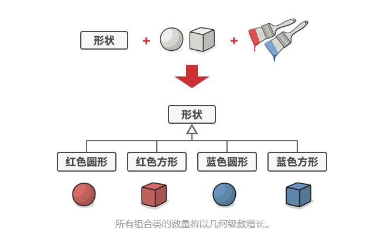
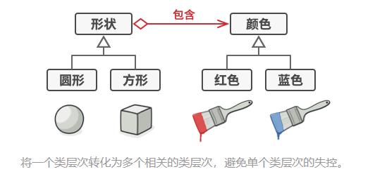
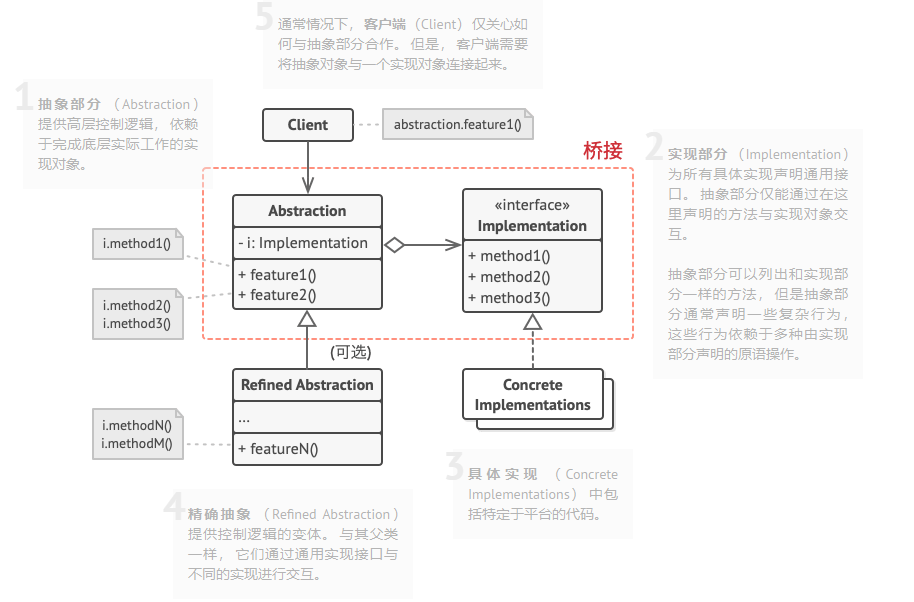

### 一、意图
&ensp;&ensp;&ensp;&ensp;桥接模式可将一个大类或一系列紧密相关的类拆分为抽象和实现两个独立的层次结构，从而能在开发时分别使用。
### 二、问题
&ensp;&ensp;&ensp;&ensp;假如有一个几何形状Shape类，从它可以扩展出两个子类：原型Circle和放行Square。如果希望对形状类层次结构进行扩展以使其包含颜色，打算创建名为红色Red和蓝色Blue的形状子类。按照组合关系，需要创建四个子类才能覆盖所有组合。

&ensp;&ensp;&ensp;&ensp;在层次结构中新增形状和颜色将导致代码复杂程度指数增长。

### 三、解决方案
&ensp;&ensp;&ensp;&ensp;问题的根本原因是试图在两个独立的维度（形状和颜色）上扩展形状类。这在处理类继承时是很常见的问题。

&ensp;&ensp;&ensp;&ensp;桥接模式通过将继承改为组合方式来解决这个问题。具体来说，就是抽象其中一个维度并使之成为独立的类层次，这样就可以在初始类中引用这个新层次的对象，从而使得一个类不必拥有所有的状态和行为。

&ensp;&ensp;&ensp;&ensp;根据该方法，可以将颜色相关的代码抽取到拥有`红色`和`蓝色`两个子类的颜色类中，然后在`形状`类中添加一个指向某一颜色对象的引用成员变量。现在，形状类可以将所有与颜色相关的工作委派给连入的颜色对象。这样的引用就成为`形状`和`颜色`之间的桥梁。

### 四、桥接模式结构

### 五、应用场景
- 如果你需要拆分或重组一个具有多重功能的庞杂类（例如能与多个数据库服务进行交互的类），可以使用桥接模式

&ensp;&ensp;&ensp;&ensp;类的代码越多，弄清楚其运作方式就越困难，对其进行修改所花费的时间就越长。 一个功能上的变化可能需要在整个类范围内进行修改， 而且常常会产生错误， 甚至还会有一些严重的副作用。

&ensp;&ensp;&ensp;&ensp;桥接模式可以将庞杂类拆分为几个类层次结构。此后，可以修改任意一个类层次结构而不影响到其他类层次结构。这种方法可以简化代码的维护工作，并将修改已有代码的风险降到最低。
- 如果你希望在几个独立维度上扩展一个类，可使用该模式

&ensp;&ensp;&ensp;&ensp;桥接模式将每个维度抽象为独立的类层次。初始类将相关工作委派给属于对应层次的对象，无需自己完成所有工作。

- 如果你需要在运行时切换不同的实现方法，可使用桥接模式

&ensp;&ensp;&ensp;&ensp;桥接模式可替换抽象部分中的实现对象，具体操作就和给成员变量赋新值一样简单。

### 六、实现方式
- 明确类中独立的维度。独立的概念可能时：抽象/平台、域/基础设施、前端/后端或接口/实现。
- 了解客户端的业务需求，并在抽象基类中定义它们
- 确定在所有平台上都可执行的业务，并在通用实现接口中声明抽象部分所需的业务
- 为所有平台创建实现类，但需确保它们遵循实现部分的接口
- 在抽象类中添加指向实现类型的引用成员变量。抽象部分会将大部分工作委派给该成员变量所指向的实现对象
- 如果你的高层逻辑有多个变体，则可通过扩展抽象基类为每个变体创建一个精确抽象
- 客户端代码必须将实现对象传递给抽象部分的构造函数才能使其能够相互互联。此后，客户端只需与抽象对象进行交互，无需和实现对象大交道
### 七、优缺点
#### 7.1、优点
- 可以创建与平台无关的类和程序
- 客户端代码仅与高层抽象部分进行互动，不会接触到平台的详细信息
- 开闭原则，可以新增抽象部分和实现部分，且它们之间不会互相影响
- 单一职责原则，抽象部分专注于处理高层逻辑，实现部分处理平台细节
#### 7.2、缺点
- 对高内聚的类使用该模式可能会让代码更加复杂