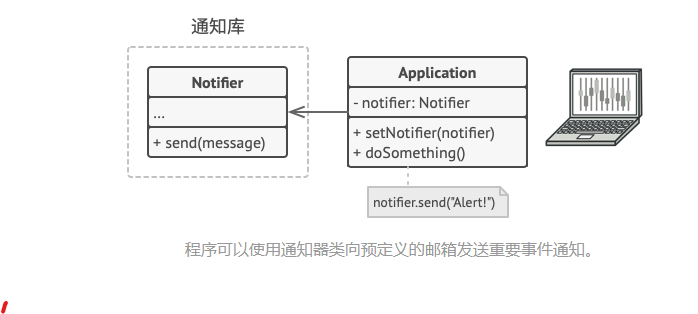

### 一、意图
&ensp;&ensp;&ensp;&ensp;桥接模式可将一个大类或一系列紧密相关的类拆分为抽象和实现两个独立的层次结构，从而能在开发时分别使用。
### 二、问题
&ensp;&ensp;&ensp;&ensp;假如有一个几何形状Shape类，从它可以扩展出两个子类：原型Circle和放行Square。如果希望对形状类层次结构进行扩展以使其包含颜色，打算创建名为红色Red和蓝色Blue的形状子类。按照组合关系，需要创建四个子类才能覆盖所有组合。

### 三、解决方案

### 四、桥接模式结构

### 五、应用场景

### 六、实现方式

### 七、优缺点