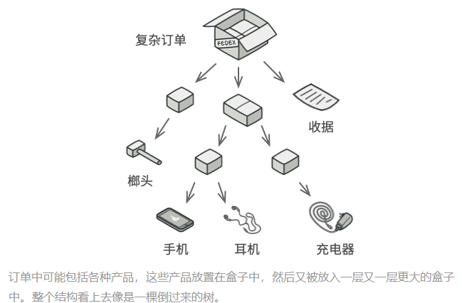
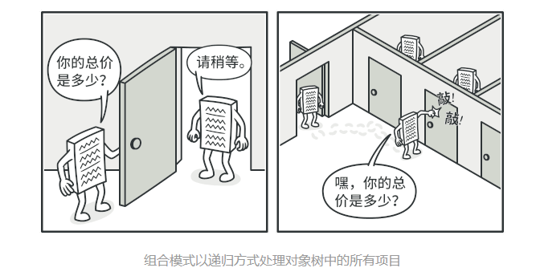
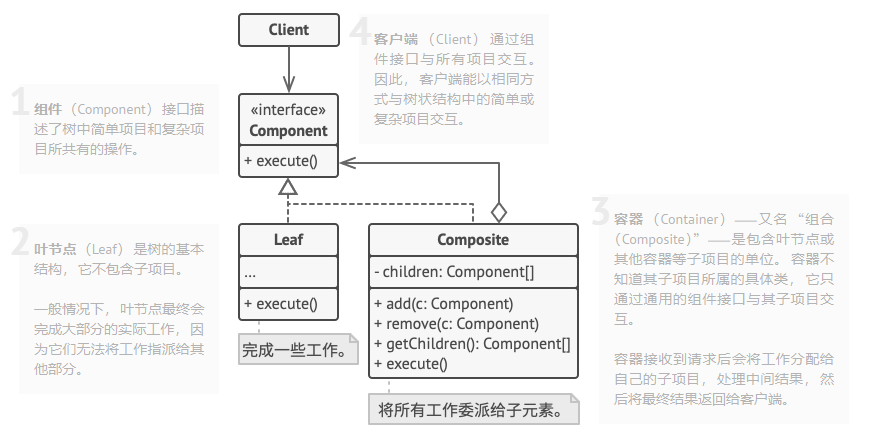

### 一、意图
&ensp;&ensp;&ensp;&ensp;组合模式时一种结构型设计模式，可以使用它将对象组合成树状结构，并且能像使用独立对象一样使用它们。
### 二、问题
&ensp;&ensp;&ensp;&ensp;如果应用的核心模型能用树状结构表示，在应用中使用组合模式才有价值。例如，有两类对象：产品和盒子，一个盒子可以包含多个产品或者几个小的盒子。这些小盒子中同样可以包含一些产品或更小的盒子，以此类推。

&ensp;&ensp;&ensp;&ensp;假设希望在这些类的基础上开发一个订购系统。订单中可以包含无包装的简单产品，也可以包含装满产品的盒子。此时应该怎么计算订单的总价格呢？

&ensp;&ensp;&ensp;&ensp;你可以尝试直接计算： 打开所有盒子， 找到每件产品， 然后计算总价。 这在真实世界中或许可行， 但在程序中， 你并不能简单地使用循环语句来完成该工作。 你必须事先知道所有 产品和 盒子的类别， 所有盒子的嵌套层数以及其他繁杂的细节信息。 因此， 直接计算极不方便， 甚至完全不可行。

### 三、解决方案
&ensp;&ensp;&ensp;&ensp;组合模式建议使用一个通用接口来与`产品`和`盒子`进行交互，并且在该接口中声明一个计算总价格的方法。

&ensp;&ensp;&ensp;&ensp;那么方法该如何设计呢？ 对于一个产品， 该方法直接返回其价格； 对于一个盒子， 该方法遍历盒子中的所有项目， 询问每个项目的价格， 然后返回该盒子的总价格。 如果其中某个项目是小一号的盒子， 那么当前盒子也会遍历其中的所有项目， 以此类推， 直到计算出所有内部组成部分的价格。 你甚至可以在盒子的最终价格中增加额外费用， 作为该盒子的包装费用。

&ensp;&ensp;&ensp;&ensp;该方法的最大优势在于你无需了解构成树状结构的对象的具体类。你也无需了解对象是简单的产品还是复杂的盒子。你只需要调用通用的接口以相同的方式对其进行处理即可。当你调用该方法后，对象会将请求沿着树结构传递下去。

### 四、组合模式结构

### 五、应用场景
- 如果你需要实现树状对象结构，可以使用组合模式

&ensp;&ensp;&ensp;&ensp;组合模式为你提供了两种共享公共接口的基本元素类型：简单叶节点和复杂容器。容器中可以包含叶节点和其他容器。这使得可以构建树状嵌套递归的对象结构。

- 如果你希望客户端代码以相同方式处理简单和复杂元素，可以使用组合模式
&ensp;&ensp;&ensp;&ensp;组合模式定义的所有元素共用同一接口，在这一接口的帮助下，客户端不必在意其所使用的对象具体类。

### 六、实现方式
- 确保应用的核心模型能够以树状接口表示。尝试将其拆分为简单元素和容器
- 声明组件接口及其一系列方法，这些方法对简单和复杂元素都有意义
- 创建一个叶节点表示简单元素，可以有多个不同的叶节点
- 创建一个容器类表示复杂元素。在该类中，创建一个数组成员变量来存储对于其子元素的引用。该数组必须能够同时保存叶节点和容器，因此请确保将其声明为组合接口类型。
- 在容器中定义添加和删除子元素的方法

### 七、优缺点
#### 7.1、优点
- 可以使用多态和递归机器更方便的使用复杂的树结构
- 开闭原则：无需变更现有代码，你就可以在应用中添加新元素，使其成为对象树的一部分
#### 7.2、缺点
- 对于功能差异较大的类，提供公共接口或许会有困难。在特定情况下，需要过度一般化组件接口，使其变得令人难以理解