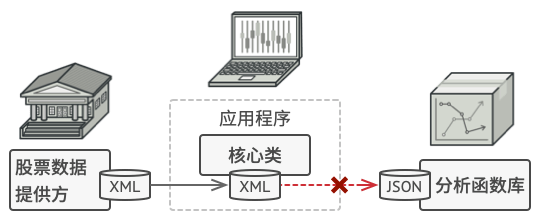
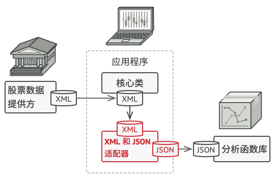
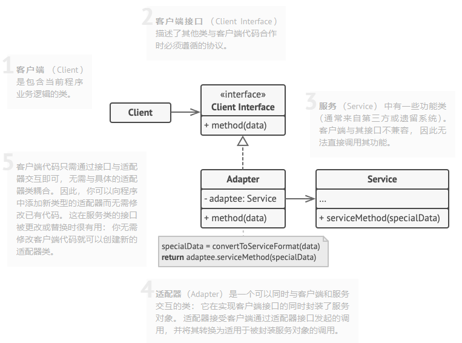
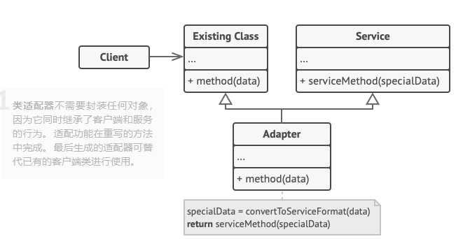

### 一、意图
&ensp;&ensp;&ensp;&ensp;适配器模式是一种结构性设计模型，它能使接口不兼容的对象能够相互合作。
### 二、问题
&ensp;&ensp;&ensp;&ensp;假如你正在开发一款股票市场监测程序， 它会从不同来源下载 XML 格式的股票数据， 然后向用户呈现出美观的图表。

&ensp;&ensp;&ensp;&ensp;在开发过程中， 你决定在程序中整合一个第三方智能分析函数库。 但是遇到了一个问题， 那就是分析函数库只兼容 JSON 格式的数据。

&ensp;&ensp;&ensp;&ensp;你可以修改程序库来支持 XML。 但是， 这可能需要修改部分依赖该程序库的现有代码。 甚至还有更糟糕的情况， 你可能根本没有程序库的源代码， 从而无法对其进行修改。

### 三、解决方案
&ensp;&ensp;&ensp;&ensp;可以创建一个适配器，适配器是一个特殊的对象，能够转换对象接口，使其能与其他对象进行交互。
&ensp;&ensp;&ensp;&ensp;适配器模式通过封装对象将复杂的转换过程隐藏于幕后。被封装的对象甚至察觉不到适配器的存在。
&ensp;&ensp;&ensp;&ensp;适配器不仅可以转换不同格式的数据，其还有助于采用不同接口的对象之间的合作。合作方式如下：

- 适配器实现与其中一个现有对象兼容的接口
- 现有对象可以使用该接口安全地调用适配器方法
- 适配器方法被调用后将以将以另一个对象兼容的格式和顺序将请求传递给该对象

&ensp;&ensp;&ensp;&ensp;在股票分析场景，为了解决数据格式不兼容的问题，可以为分析函数库中的每个类创建将XML转换为JSON格式的适配器，然后让客户端仅通过这些适配器来与函数库进行交流。当某个适配器被调用时，它会将传入的XML数据转换为JSON结构，并将其传递给被封装分析对象的方法中。

### 四、适配器模式结构
- 对象适配器

&ensp;&ensp;&ensp;&ensp;这一实现使用了构成原则：适配器实现了其中一个对象的接口，并对另一个对象进行封装。

- 类适配器

&ensp;&ensp;&ensp;&ensp;这一实现使用了继承机制：适配器同时继承两个对象的接口。请注意，这种方式仅能在支持多重继承的编程语言中实现。

### 五、应用场景
- 当希望使用某个类，但是其接口与其他代码不兼容时，可以使用适配器模式
&ensp;&ensp;&ensp;&ensp;适配器模式允许创建一个中间层类，其可作为代码与遗留类、第三方类或提供怪异接口的类之间的转换器。
- 如果需要复用一些类，它们处于同一继承体系，并且它们又有了额外的一些共同方法，但是这些共同的方法不是所有在这一继承体系中的子类所具有的共性。
&ensp;&ensp;&ensp;&ensp;可以通过扩展每个子类，将缺少的功能添加到新的子类中。但是，你必须在新的子类中重复添加这些代码，这样会是的代码有坏味道。
&ensp;&ensp;&ensp;&ensp;将缺失功能添加到一个适配器类中是一种优雅得多的解决方案。然后可以将缺少功能对象封装在适配器中，从而动态地获取所需功能。如果这一点正常运作，目标类必须要有通用接口，适配器的成员变量应该遵循该通用接口。
### 六、实现方式
- 确保至少有两个类的接口不兼容
  - 一个无法修改的功能性服务类
  - 一个或多个将受益于使用服务类的客户端类
- 声明客户端接口，描述客户端如何与服务交互
- 创建遵循客户端接口的适配器类，所有方法暂时都为空
- 在适配器类中增加一个成员变量用于保存对于服务对象的引用。通常情况下会通过构造函数对该成员变量进行初始化，但有时在调用其方法时将该变量传递给适配器会更方便
- 依次实现适配器类客户端接口的所有方法。适配器会将实际工作委派给服务对象，自身只负责接口或数据格式转换
- 客户端必须通过客户端接口使用适配器，这样，你就可以在不影响客户端代码的情况下修改或扩展适配器
### 七、优缺点
- 优点
  - 单一职责原则：可以将接口或数据转换代码从程序主要业务逻辑中分离
  - 开闭原则：只要客户端代码通过客户端接口与适配器进行交互，就能在不修改现有客户端代码的情况下在程序中添加新类型的适配器
- 缺点：代码整体复杂的增加，因为需要增加一系列接口和类