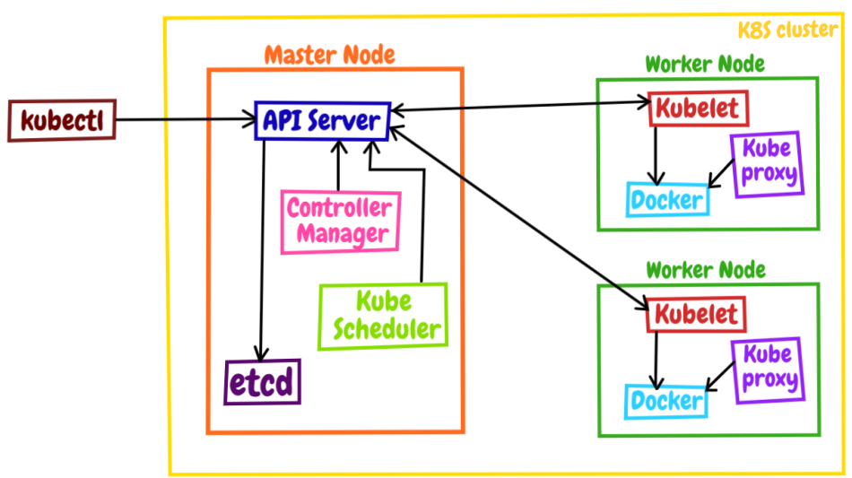
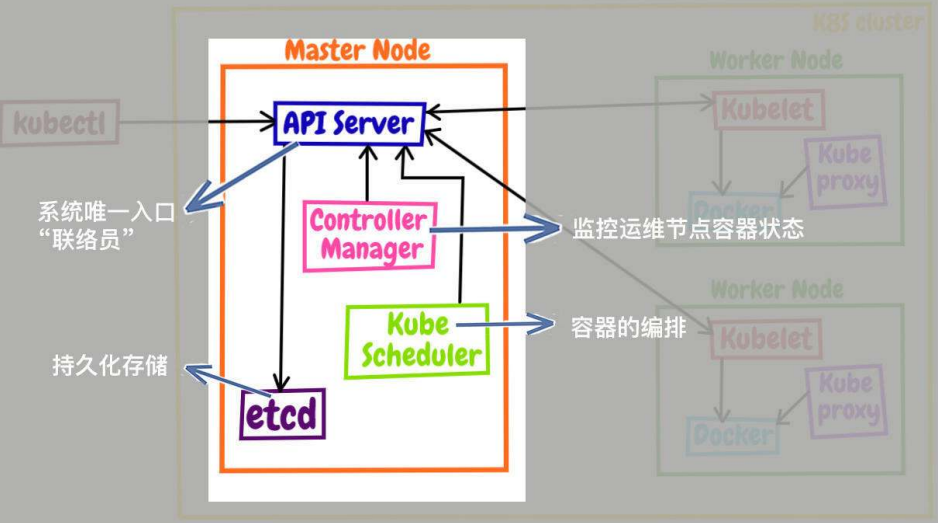
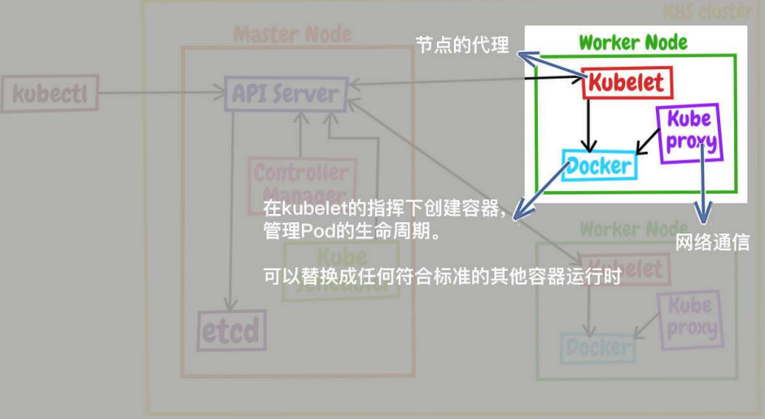
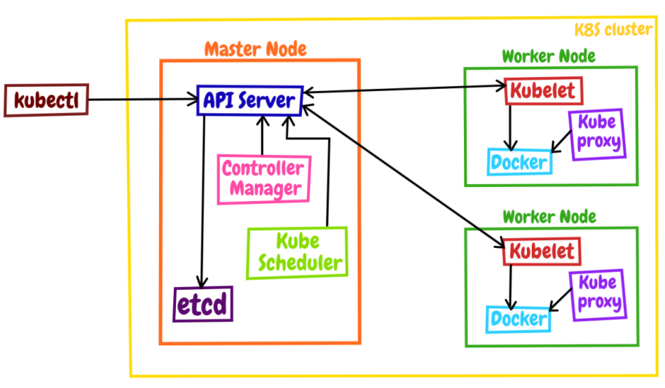

### 一、k8s的基本结构
&ensp;&ensp;&ensp;&ensp;kubernetes采用现今流行的**控制面/数据面**架构,集群里的计算机被称之为**节点**，少量的节点用作控制面来执行集群的管理维护工作，其他的大部分节点都被划归数据面，用来跑业务应用。
&ensp;&ensp;&ensp;&ensp;控制面的节点在Kubernetes里叫做**Master Node**；数据面的节点叫做**Worker Node**。
&ensp;&ensp;&ensp;&ensp;**Node**的数量非常多，构成了一个资源池，Kubernetes就在这个池里分配资源、调度应用。以为资源被"池化"，所有管理也就变得比较简单，可以在集群中任意添加或者删除节点。

&ensp;&ensp;&ensp;&ensp;kubectl是Kubernetes的客户端工具，用来操作Kubernetes，但它位于集群之外，理论上不属于集群。

### 二、节点内部结构
&ensp;&ensp;&ensp;&ensp;Kubernetes节点内部由很多模块组成，这些模块可以分为组件（核心功能）和插件（附加功能）两类。

#### 2.1、Master节点内部结构
- APIServer
&ensp;&ensp;&ensp;&ensp;apiserver是Master节点（也是Kubernetes系统）的唯一入口，它对外公开了一系列的RESTful API，并且加上了验证、授权等功能，所有其他组件都只能和它直接通信，可以说是Kubernetes里的联络员。
- Etcd
&ensp;&ensp;&ensp;&ensp;高可用的分布式k-v数据库，用来持久化存储系统里的各种资源对象和状态，相当于Kubernetes里的配置管理员（任何其他组件想要读写etcd里的数据都必须经过apiserver）。
- Scheduler
&ensp;&ensp;&ensp;&ensp;负责容器的编排工作，检查节点的资源状态，把Pod调度到适合的节点上运行，相当于部署人员。因为节点状态和Pod信息都存储在etcd里，所以scheduler必须通过apiserver才能获得。
- Controller-Manager
&ensp;&ensp;&ensp;&ensp;负责维护容器和节点等资源，实现故障检测、服务迁移、应用伸缩等功能，相当于监控运维人员。同样，它必须通过apiserver获得存储在etcd里的信息，才能实现对资源的各种操作。

&ensp;&ensp;&ensp;&ensp;这4个自建都被容器化了，运行在集群的Pod里。

#### 2.2、Worker节点内部结构
&ensp;&ensp;&ensp;&ensp;Master节点里的apiserver、scheduler等组件需要获取节点的各种信息才能做出管理决策，那这些信息该怎么来呢？就需要Worker节点中的三个组件：
- kubelet
&ensp;&ensp;&ensp;&ensp;kubelet是Node的代理，负责管理Node相关的绝大部分操作，Node上只能它能够与apiserver通信，实现状态报告、命令下发、启停容器等功能，相当于是Node上的"小管家"。
- kebe-proxy
&ensp;&ensp;&ensp;&ensp;kebe-proxy是Node的网络代理，只负责管理容器的网络通信，简单说就是为Pod转发TCP/UDP数据包。
- container-runtime
&ensp;&ensp;&ensp;&ensp;是容器和镜像的是使用者，在kubelet的指挥下创建容器，管理Pod的生命周期。

&ensp;&ensp;&ensp;&ensp;这三个组件中只有kube-proxy被容器化；kubelet因为必须要管理整个节点，容器化会限制它的能力，所以它必须在container-runtime之外运行。

&ensp;&ensp;&ensp;&ensp;Kubernetes工作流程：
- 每个Node上的kubelet会定期向apiserver上报节点状态，apiserver再存到etcd里
- 每个Node上kube-proxy实现了TCP/UDP反向代理，让容器对外提供稳定的服务
- scheduler通过apiserver得到当前节点的状态，调度Pod，然后apiserver下发命令给某个Node的kubelet，kubelet调用container_runtime启动容器
- controller-manager通过apiserver得到实时的Node状态，监控可能的异常情况，再使用相应的手段去调节恢复。

### 三、