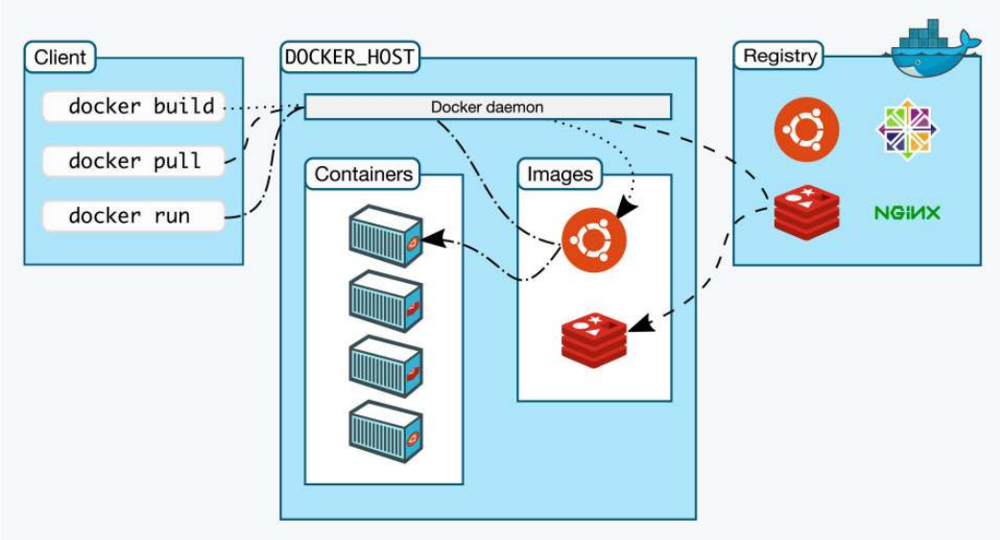

### 一、Docker的架构
&ensp;&ensp;&ensp;&ensp;下图精确描述了Docker Engine的内部角色和工作流程。Docker Engine是典型的C/S架构，Docker Client命令行工具会与Docker Engine里的后台服务Docker Daemon通信，而镜像则存储在远端的仓库Registry里，Docker daemon和Registry协作完成各种功能；客户端并不直接访问镜像仓库。

&ensp;&ensp;&ensp;&ensp;Docker三大组件包括：镜像(Image)、容器(Container)、仓库(Repository)。

#### 1.1、Docker镜像
&ensp;&ensp;&ensp;&ensp;可以使用`docker build`命令制作镜像。
#### 1.2、Docker仓库
- 为什么需要仓库
&ensp;&ensp;&ensp;&ensp;通过`docker build`制作的镜像还在本机上，只能自己使用，如果多用户之间需要共享镜像，则可以将镜像存储在镜像仓库中。Docker官方默认的仓库是Docker Hub。
- 拉取镜像
&ensp;&ensp;&ensp;&ensp;把镜像从仓库中拉取到本地`docker pull **:**`。
- 推送镜像
&ensp;&ensp;&ensp;&ensp;将本地制作的镜像推送到仓库中`docker push **:**`。
#### 1.3、Docker容器
- 启动容器
&ensp;&ensp;&ensp;&ensp;制作好的镜像，可以直接用来创建容器`docker run -d -p 8080:8080 **:**`。
- 容器与镜像关系
  - Docker类比面向对象

    | OOP                   | Docker|
    | :----:                | :----: |
    | 类                    | 镜像 |
    | 对象                  | 容器 |
    | 设置字段的值          | 安装的包 |
    | 执行的方法            | Dockerfile中声明的CMD |
    | 用类作为模板创建对象   | 用镜像作为模板创建容器 |
    | 一个类可以创建多个对象 | 一个镜像可以创建多个容器 |
    | 继承类                | 基于镜像(From) |
  
  - Docker容器类比虚拟机
&ensp;&ensp;&ensp;&ensp;Docker容器不是虚拟机。不过为了立即镜像和容器的关系，这里只是做个类比：把Docker镜像类比成VirtualBox虚拟机镜像文件；把Docker容器类比成VirtualBox的虚拟机。

    |   VirtualBox         | Docekr |
    | :----:               | :----: |
    | VM镜像文件            | Docker镜像 |
    | VM加载镜像文件         | Docker加载镜像 |
    | 用VM镜像创建虚拟机      | 用Docker镜像创建容器 |
    | 虚拟机可以启动、退出、删除 | 容器可以启动、退出、删除 |
    | 在虚拟机中部署应用 | 在容器中部署应用 |
    | 可以端口映射 | -p端口映射 |
#### 1.4、C/S架构
&ensp;&ensp;&ensp;&ensp;Docker是一个C/S模式的架构，后端是一个松耦合架构，模块各司其职，下面是它的总体架构图：

- 客户端
&ensp;&ensp;&ensp;&ensp;如架构图左边部分是客户端（Docker命令行工具），通常用于执行Docker的各种命令，然后通过调用API发送请求给守护进程。
- 服务器
&ensp;&ensp;&ensp;&ensp;如架构图中间部分是服务器，其中Docker Daemon守护进程用来接收来自客户端的请求。对镜像、仓库、容器进行各种操作并响应给客户端。

### 二、容器的本质
&ensp;&ensp;&ensp;&ensp;容器是一个特殊的隔离环境，它能够让进程只看到这个环境里的有限信息，不能对外界环境施加影响。

#### 2.1、为什么需要隔离
&ensp;&ensp;&ensp;&ensp;隔离的目的是为了系统安全。对于Linux系统来说，一个不受限制的应用程序是十分危险的。这个进程可以看到系统里所有的文件、所有的进程、所有的网络流量，访问内存里的所有数据，这是非常危险的。Linux引入了用户权限控制，能够限制进程只访问某些资源，但这个机制还是比较薄弱的，与真正的"隔离"相差甚远。

&ensp;&ensp;&ensp;&ensp;使用容器技术，可以让应用程序运行在一个严密防护的"沙箱"环境之内。

#### 2.2、隔离的实现
##### 2.2.1、namespace

&ensp;&ensp;&ensp;&ensp;利用namespace可以创建出独立的文件系统、主机名、进程号、网络资源空间。

- 进程id：pid namespace
- 主机名：uts namespace
- 文件名：mnt namespace
- 网络访问：net namespace
- 进程间通信：ipc namespace

##### 2.2.2、cgroup

&ensp;&ensp;&ensp;&ensp;cgroup用来实现对进程的CPU、内存等资源的优先级和配额限制。

##### 2.2.3、chroot

&ensp;&ensp;&ensp;&ensp;chroot可以更改进程的根目录，也就是限制访问文件系统。

### 三、编写高效的Dockerfile
#### 3.1、镜像的内部机制
&ensp;&ensp;&ensp;&ensp;镜像文件是一个打包文件，里面包括应用程序、运行应用程序所依赖的环境，包括文件系统、环境变量、配置参数等。环境变量和配置参数相对较好管理，真正麻烦的是文件系统，为了保证容器运行环境的一致性，镜像必须把应用程序所在操作系统的根目录rootfs都包含进来。

&ensp;&ensp;&ensp;&ensp;虽然这些文件不包含系统内核（因为容器共享宿主机的内核），但如果每个镜像都重复做这样的打包操作，仍然会导致⼤量的冗余。应该把重复的部分抽取出来，只存放⼀份Ubuntu根⽬录⽂件，然后让这
⼀千个镜像以某种⽅式共享这部分数据。这个思路，也正是容器镜像的⼀个重⼤创新点：分层，术语叫“Layer”。

&ensp;&ensp;&ensp;&ensp;可以使用`docker inspect`来查看镜像的分层信息。  

#### 3.2、Dockerfile是什么

&ensp;&ensp;&ensp;&ensp;Dockerfile就是一个纯文本，里面记录了一系列的构建指令，比如选择基础镜像、拷贝文件、运行脚本等。每个指令都会生成一个Layer，而Docker顺序执行这个文件里的所有步骤，最后就会创建出一个新的镜像出来。

##### 3.2.1、如何编写正确、高效的Dockerfile

- 基础镜像`From`
- 拷贝`COPY`
  开发测试过程中产生的源码、配置文件，需要打包进镜像里，可以使用`COPY`命令，不过拷贝的源文件必须是"构建上下文"路径里面的，不能随意指定文件。
- 执行命令`RUN`
  `RUN`命令可以执行任意的SHELL命令，比如更新系统、安装应用、下载文件、创建目录、编译程序等。实现任意镜像构建步骤，非常灵活。
  Dockerfile里一条指令只能是一行，所有有的`RUN`指令会在每行的末尾使用续行符`\`，命令之间也会使用`&&`来连接，这样保证在逻辑上是一行。

##### 3.2.2、Docker build是如何工作的
&ensp;&ensp;&ensp;&ensp;Dockerfile必须要经过`docker build`才能有效。
&ensp;&ensp;&ensp;&ensp;`docker`是一个简单的客户端，真正的镜像构建工作是由服务器端"Docker daemon"来完成的，所以`docker`客户端只是把"构建上下文"目录打包上传，这样服务器端才能够获取本地的这些文件。
&ensp;&ensp;&ensp;&ensp;但这个机制会导致一些麻烦，如果目录里有的文件不需要拷贝进镜像，docker也会打包上传，效率很低。为了避免这种问题，可以在"构建上下文"目录里再创建一个`.dockerignore`文件，语法与`.gitignore`类似，排除这些不需要的文件。

##### 3.2.3、构建镜像

&ensp;&ensp;&ensp;&ensp;使用`docker build -f`指定Dockerfile，完成镜像构建。

### 四、容器如何与外界互联互通

### 五、总结

### 参考文档
[深入理解 Docker 架构](https://zhuanlan.zhihu.com/p/621046128)