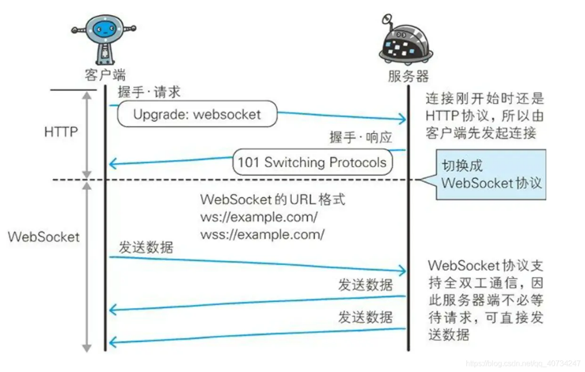

### 一、基本原理
&ensp;&ensp;&ensp;&ensp;基于TCP协议，一次握手就能建立连接，支持双向通信，可保持长连接。

#### 1.1、优点
- 支持双向通信，实时性更强
- 更好的二进制支持
- 较少的控制开销。连接创建后，ws客户端、服务端进行数据交换时，协议控制的数据包头部较小。
- 支持扩展

### 二、如何建立连接

### 三、数据帧格式

### 四、数据传递

### 五、连接保持和心跳

### 六、数据掩码的作用

https://www.cnblogs.com/chyingp/p/websocket-deep-in.html

https://apifox.com/apiskills/websocket-protocol/