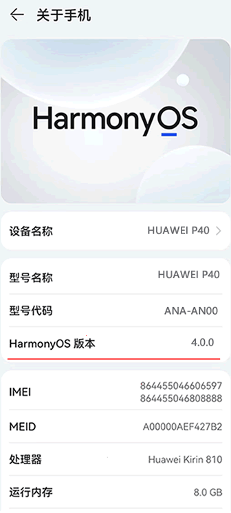
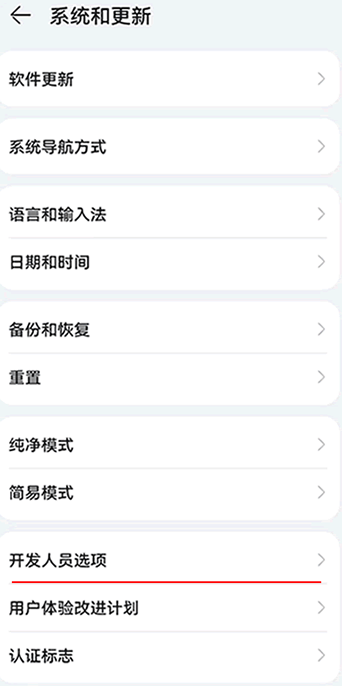
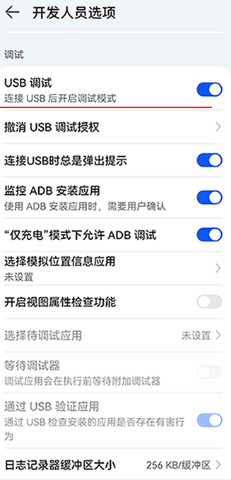

# 一、ADB环境准备
## 1.1、下载ADB工具https://adb.clockworkmod.com/
## 1.2、开启调试模式
- 开启开发者模式
<div align=center></div>

- 开启USB调试
<div align=center>></div>

- 查看设别

```sh
adb.exe devices
```

# 二、Python ADB

# 三、存在的问题
## 1、'adb' 不是内部或外部命令，也不是可运行的程序
解决方法：将adb.exe添加到PATH

## 2、vscode输出中文乱码
解决方法：python -X utf-8 test.py