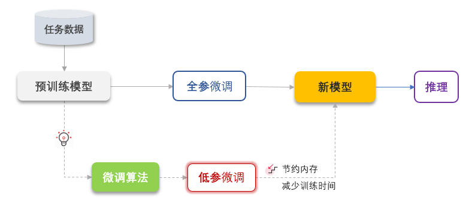

### 一、Fine-turning地本质
1、微调地定义
大模型微调是利用特定领域的数据集对已训练的大模型进行进一步训练的过程。它旨在优化模型在特定任务上的性能，使模型能够更好地适应和完成特定领域的任务。
2、微调地核心原因
- 定制化功能：微调的核心原因是赋予大模型更加定制化的功能。通用大模型虽然强大，但在特定领域可能表现不佳。通过微调，可以使模型更好的适应特定领域的需求和特征。
- 领域知识学习：通过引入特定领域的数据集进行微调，大模型可以学习该领域的知识和语言模型。这有助于模型在特定任务上取得更好的性能。

3、微调与超参数优化
微调过程中，超参数的调整至关重要。超参数如学习率、批次大小和训练轮次等要根据特定任务和数据集进行调整，以确保模型在训练过程中的有效性和性能。

### 二、Fine-tuning原理
大模型微调是在选定相关数据集和预训练模型的基础上，通过设置合适的超参数并对模型进行必要的调整，使用特定任务的数据对模型进行训练以优化其性能。
大模型微调包含以下四个步骤：
- 数据准备
  - 选择与任务相关的数据集
  - 对数据进行预处理，包括清洗、分词和编码
- 选择基础模型
- 设置微调参数
  - 设定学习率、训练轮次、批处理大小等超参数
  - 根据需要设定其他超参数，如权重衰减、梯度剪切等
- 微调流程
  - 加载预训练模型和权重
  - 根据任务需要对模型进行必要的修改，如更改输出层
  - 选择合适的损失函数和优化器
  - 使用选定的数据集进行微调训练，包括前向传播、损失计算、反向传播和权重更新

