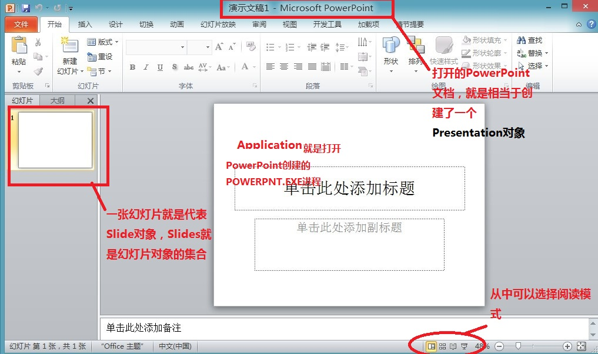

### 一、实现思路
- 需要获取PowerPoint应用程序，在PowerPoint对象模型中，Microsoft.Office.Interop.PowerPoint.Application代表PowerPoint应用程序。
- 获取PowerPoint演示文稿对象，PowerPoint对象模型中，Microsoft.Office.Interop.PowerPoint.Presentation代表演示文稿对象
- 获取PowerPoint对象，PowerPoint对象模型中也提供了幻灯片对象，即Microsoft.Office.Interop.PowerPoint.Slide
- 获得幻灯片对象后，可以使用幻灯片对象的Select方法来进行幻灯片切换，然而在阅读模式下，不能用Select方法来进行翻页，此时需要另一种方法来实现，即调用Microsoft.Office.Interop.PowerPoint.SlideShowView对象的First、Next、Last、Previous方法来进行幻灯片翻页。

<div align=center></div>

### 二、幻灯片文档操作
- Open
&ensp;&ensp;&ensp;&ensp;使用Application.Presentations.Open方法打开指定PPT文档。
- SaveAs
&ensp;&ensp;&ensp;&ensp;使用Presentation.SaveAs方法另存PPT文档。
- Close
&ensp;&ensp;&ensp;&ensp;使用Presentations.Close方法关闭PPT文档。

### 三、幻灯片操作
- 通过 SlideShowWindow 控制翻页
&ensp;&ensp;在幻灯片放映模式下，可以使用`SlideShowWindow`对象控制当前显示的幻灯片。
  - Run：开始放映
  - Next：翻到下一页
  - Previous：翻到上一页
  - GotoSlide：跳转到指定页（索引从1开始）
  - Exit：结束放映

- 在编辑模式下切换幻灯片
&ensp;&ensp;即使不在放映模式，也可以通过`ActiveWindow.View`控制当前显示的幻灯片。
```C++
// 确保演示文档在视图中可见
presentation.Window[1].Activate();

// 获取当前视图
SlideView slideView = (SlideView)presentation.Window[1].view;

// 跳转到指定幻灯片
slideView.Slide = presentation.Slide[3];
```

- 通过SlideShowView控制各种操作
&ensp;&ensp;通过`SlideShowView`对象可以精确控制放映过程中的各种操作。
  - Run：开始放映
  - Next：翻到下一页
  - Previous：翻到上一页
  - GotoSlide：跳转到指定页（索引从1开始）
  - First：跳转到第一张幻灯片
  - Last：跳转到组后一张幻灯片
  - Pause：暂停放映
  - Resume：继续放映

- 处理幻灯片切换事件
&ensp;&ensp;可以通过事件监听幻灯片切换，实现自动化操作。