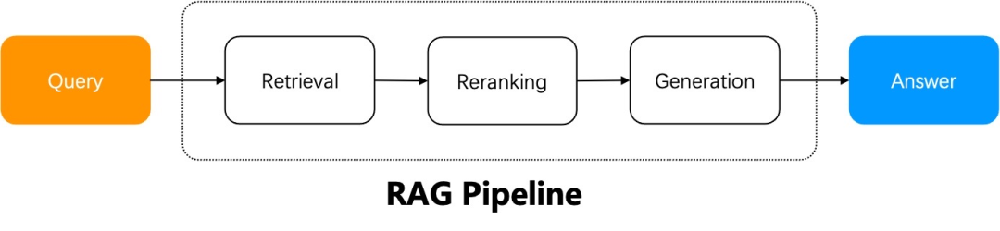
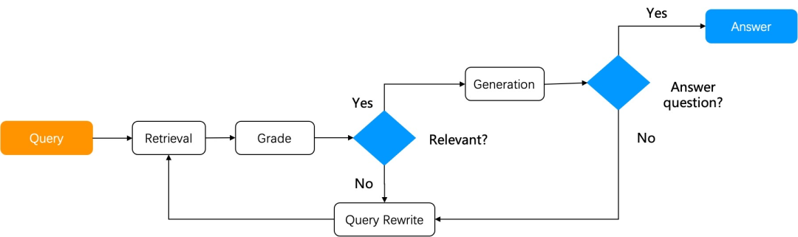
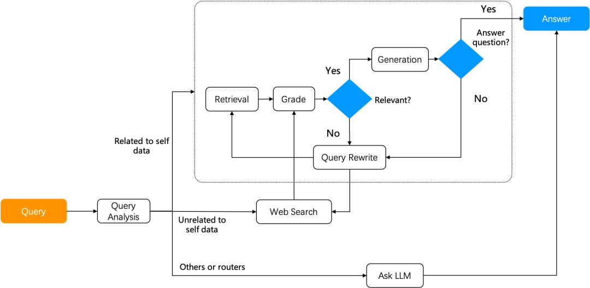

#### 一、Agentic RAG
&ensp;&ensp;&ensp;&ensp;最简单的RAG系统流程如下图所示：
首先，用户提出问题，然后系统基于用户提问进行召回，对召回结构进行重排序，最后拼接提示词后送给LLM生成答案。

&ensp;&ensp;&ensp;&ensp;对于简单任务，上述流程可以满足用户意图。然而对于更多用户意图不明确，无法直接通过检索找到答案的场景（需要进行多步推理），需要引入Agentic RAG，也就是在问答过程中引入任务编排机制。
&ensp;&ensp;&ensp;&ensp;Agentic RAG是基于Agent的RAG。Agent与RAG关系密切，两者互为基石。Agentic RAG和简单RAG的最大却别在于Agentic RAG引入了Agent的动态编排机制，因此可以根据用户提问的不同意图，引入反馈和查询改写机制，并进行"多跳"式的知识推理，从而实现复杂提问的回答。

&ensp;&ensp;&ensp;&ensp;下面给出两个高级Agentic RAG的工作原理：
- Self-RAG
&ensp;&ensp;&ensp;&ensp;Self-RAG是一种引入了反思机制的RAG。从知识库中检索出结果后，它会评估结果是否与用户提问相关。如果不相关，就要改写查询，然后重复RAG流程知道相关评分达到要求。Self-RAG包括两大组件：
  - 基于Graph的任务编排系统
  - Graph内执行的必要算子：如评分算子。

&ensp;&ensp;&ensp;&ensp;Self-RAG对相对复杂的多跳问答和多步推理可以明显提升性能。

- Adaptive-RAG
&ensp;&ensp;&ensp;&ensp;可以根据用户提问的不同意图采用对应的策略：
    - 开放域问答：直接通过LLM产生答案而无需依赖RAG检索。
    - 多跳问答：首先，将多跳查询分解为更简单的单挑查询，重复访问LLM和RAG检索器来解决这些子查询；最后结合它们的答案形成完整答案。
    - 自适应检索：适用于更多步逻辑推理的复杂问题。复杂的问答往往需要从多个数据源综合信息进行多步推理。子使用检索通过迭代地访问RAG检索器和LLM，逐步构建解决问题所需地信息链。

#### 二、检索器（Retriever）

#### 三、重排序器（ReRanker）
&ensp;&ensp;&ensp;&ensp;重排序阶段扮演着至关重要的角色。该阶段的目标是对初步检索得到的大量文档进行再次筛选和排序，以确保生生成阶段能够优先利用最相关的信息。这一阶段类似于传统信息检索中的两阶段排序策略：粗排（追求搞笑的检索速度）和精排（专注于提升结果的相关性和准确性）。
&ensp;&ensp;&ensp;&ensp;重排方法主要分为以下两类：
- 基于重排模型
&ensp;&ensp;&ensp;&ensp;重排模型将查询和上下文作为输入，并直接输出相似性score。
- 基于LLM
&ensp;&ensp;&ensp;&ensp;也可以使用LLM实现重排。现有的涉及LLM的重排方法可以分为三类：将LLM与重排任务一起微调、提示LLM进行重排、训练过程中使用LLM进行数据微调。