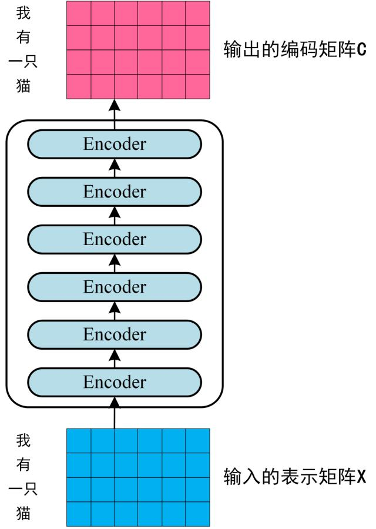
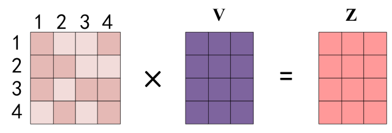
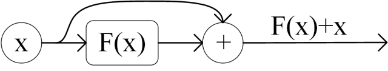
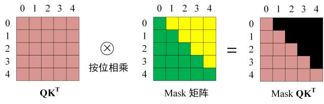
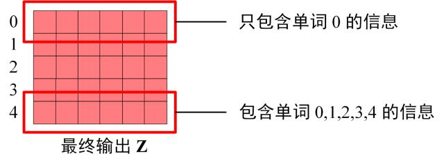

### 一、Transformer整体结构
&ensp;&ensp;下图时Transformer用于中英文翻译的整体结构：

Transformer的整体结构，作图Encoder，右图Decoder

&ensp;&ensp;可以看到*Transformer*由*Encoder*编码器和*Decoder*解码器两部分组成，编码器和解码器都包含6个block。Transformer的工作流程如下：
- 第一步：获取句子中每个单词的表示向量**x**，**x**由单词的Embedding（Embedding就是由原始数据提取出来的Feature）和单词位置的Embedding相加得到。

Transformer的输入表示

- 第二步：将得到的单词表示向量矩阵（每一行是一个单词的表示*x*）传入Encoder，经过6个Encoder block后可以得到句子所有单词的编码信息矩阵**C**，如下图。单词向量矩阵用$X_{n*d}$表示，n时句子中单词的个数，d表示向量维度。每一个Encoder block输出的矩阵维度与输入完全一致。

Transformer Encoder编码句子信息

- 第三步：将Encoder输出的编码信息矩阵**C**传递到Decoder中，Decoder依次会根据当前翻译过的单词1~i翻译下一个单词i+1，如下图所示。在使用过程中，翻译到单词i+1的时候需要通过**Mask(掩盖)**操作遮住i+1之后的单词。

Transformer Decoder预测

&ensp;&ensp;上图Decoder接收了Encoder的编码矩阵**C**，然后首先输入一个翻译开始符"<Begin>"，预测第一个单词"I"；然后输入翻译开始符"<Begin>"和单词"I"，预测单词"have"，以此类推。这是Transformer使用时候的大致流程。

### 二、Transformer的输入
&ensp;&ensp;Transformer中单词的输入表示**x**由**单词的Embedding**和**位置Embedding**(Positional Encoding)相加得到。

Transformer 输入表示

#### 2.1、单词Embedding
&ensp;&ensp;单词的Embedding由很多种方式可以获取，例如可以采用Word2Vec、Glove等算法预训练得到，也可以在Transformer中训练得到。

#### 2.2、位置Embedding
&ensp;&ensp;Transformer中除了单词的Embedding，还需要使用位置Embedding 表示单词出现在句子中的位置。**因为Transformer不采用RNN的结构，而是使用全局信息，不能利用单词的顺序信息，而这部分信息对于NLP来说非常重要**。所以Transformer中使用位置Embedding 保存单词在序列中的相对或绝对位置。

&ensp;&ensp;位置Embedding用**PE**表示，**PE**的维度和单词Embedding是一样的。PE可以通过训练得到，也可以使用某种公式计算得到。在Transformer中使用了后者，计算公式如下：

&ensp;&ensp;其中，pos表示单词在句子中的位置，d表示PE的维度（与词Embedding一样），2i表示偶数的维度，2i+1表示奇数维度（即2i<d;2i+1<d）；使用这种公式计算PE会有以下好处：
- 使 PE 能够适应比训练集里面所有句子更长的句子，假设训练集里面最长的句子是有 20 个单词，突然来了一个长度为 21 的句子，则使用公式计算的方法可以计算出第 21 位的 Embedding。
- 可以让模型容易地计算出相对位置，对于固定长度的间距 k，PE(pos+k) 可以用 PE(pos) 计算得到。因为 Sin(A+B) = Sin(A)Cos(B) + Cos(A)Sin(B), Cos(A+B) = Cos(A)Cos(B) - Sin(A)Sin(B)。

&ensp;&ensp;将单词的词 Embedding 和位置 Embedding 相加，就可以得到单词的表示向量**x**，**x** 就是 Transformer 的输入。

### 三、Self-Attention自主意力机制

&ensp;&ensp;上图是Transformer地内部结构图，左侧为Encoder block，右侧为Decoder block。红色圈中地部分为**Multi-Head Attention**，是由多个**Self-Attention**组成地，可以看成Encoder block包含一个Multi-Head Attention，而Decoder block包含两个Multi-Head Attention（其中一个用到Masked）。Multi-Head Attention上方还包含一个Add & Norm层，Add表示残差连接用于防止网络退化，Norm表示Layer Normalization，用于对每一层地激活值进行归一化。

&ensp;&ensp;因为**Self-Attention**是Transformer的重点，所以我们重点关注Multi-Head Attention以及Self-Attention。

#### 3.1、Self-Attention结构

Transformer Self-Attention结构

&ensp;&ensp;上图是Self-Attention的结构，在计算的时候需要用到矩阵**Q(查询)、K(键值)、V(值)**。在实际中。Self-Attention接收的是输入或者上一个Encoder block的输出。而**Q、K、V**正式通过Self-Attention的输入进行线性变换得到的。

#### 3.2、Q、K、V的计算
&ensp;&ensp;Self-Attention的输入用矩阵X表示，则可以使用线性变换矩阵**WQ、WK、WV**计算得到**Q、K、V**。计算如下图所示，**注意X、Q、K、V**的每一行都表示一个单词。

Self-Attention Q、K、V的计算

#### 3.3、Self-Attention的输出
&ensp;&ensp;得到矩阵Q、K、V之后就可以计算Self-Attention的输出了，计算的公式如下：

Self-Attention的输出

&ensp;&ensp;公式中计算矩阵**Q**和**K**每一行向量的内积，为了防止内积过大，因为除以$d_{k}$的平方根。**Q**乘以**K**的转置后，得到的矩阵行类数都为n，n为句子单词数，这个矩阵可以表示单词之间的attention强度。下图为**Q**乘以$K^{T}$，1234表示的是句子中的单词。

Self-Attention Q乘以K的转置的计算

&ensp;&ensp;得到$QK^{T}$之后，使用Softmax计算每一个单词低于其他单词的attention系数，公式中的Softmax是对矩阵的每一行进行Softmax，即每一行的和都变为1。

对矩阵的每一行进行Sofrtmax计算

&ensp;&ensp;得到Softmax矩阵之后可以和**V**相乘，得到最终的输出**Z**。

Self-Attention的输出

&ensp;&ensp;上图中Softmax矩阵的第1行表示单词1与其他所有单词的attention系数，最终单词1的输出$Z_{1}$等于所有单词i的值$V_{i}$根据attention系数的比例加在一起得到，如下图所示：

Self-Attention的计算

#### 3.4、Multi-Head Attention

Multi-Head Attention

&ensp;&ensp;从上图可以看到Multi-Head Attention包含多个Self-Attention层，首先将输入**x**分别传递到h个不同的Self-Attention中，计算得到h个输出矩阵**Z**，下图时h=8时候的情况，此时会得到8个输出矩阵**Z**。

多个Self-Attention

&ensp;&ensp;得到8个输出矩阵$Z_1$至$Z_8$之后，Multi-Head Attention将它们拼接在一起，然后传入一个Linear层，得到Multi-Head Attention最终的输出**z**。

Mult-Head Attention的输出

### 四、Encoder结构

**

Transformer Encoder block结构

**
&ensp;&ensp;上图红色部分时Transformer的Encoder block结构，可以看到是由Multi-Head Attention、Add & Norm、Feed Forward、Add & Norm组成的。上一章节已经了解了Multi-Head Attention的计算过程，现在了解以下Add & Norm、Feed Forward部分。

#### 4.1、Add & Norm
&ensp;&ensp;Add & Norm层由Add和Norm两部分组成，起计算公式如下：

Add & Norm计算公式

&ensp;&ensp;其中**X**表示Multi-Head Attention或者Feed Forward的输入，MultiHeadAttention(**X**)和FeedForward(**X**)表示输出（输出和输入维度是一样的，所以可以相加）。

&ensp;&ensp;**ADD**指**X**+MultiHeadAttention(**X**)，是一种残差连接，通常用于解决多层网络训练的问题，可以让网络只关注当前残差的部分，在ResNet中经常用到：

残差连接

&ensp;&ensp;**Norm**Layer Normalization，通常用户RNN结构，Layer Normalization会将每一次神经网络的输入都转成均值方差都一样的，这样可以加速收敛。

#### 4.2、Feed Forward
&ensp;&ensp;Feed Forward层比较简单，是一个两层的全连接网络，第一层的激活函数为Relu，第二层不使用激活函数，对应的公式如下：

&ensp;&ensp;**X**是输入，Feed Forward最终得到的输出矩阵的维度与**X**一致。

#### 4.3、组成Encoder
&ensp;&ensp;通过上面描述的Multi-Head Attention、Add & Norm和Feed Forward就可以构造出一个Encoder block，Encoder block接收输入矩阵$X_{n*d}$，并输出一个$O_{n*d}$，通过多个Encoder block叠加就可以组成Encoder。

&ensp;&ensp;第一个Encoder block的输入是句子单词的表示向量矩阵，后续Encoder block的输入是前一个Encoder block的输出，最后一个Encoder block输出的矩阵就是编码信息矩阵**C**，这一矩阵后续会用到Decoder中。

### 五、Decoder结构

&ensp;&ensp;上图红色部分为Transformer的Decoder block结构，与Encoder block相似，但是存在一些区别：
- 包含两个Multi-Head Attention层
- 第一个Multi-Head Attention层采用了Masked操作
- 第二个Multi-Head Attention层的**K**、**V**矩阵使用Encoder的编码矩阵**C**进行计算，而**Q**使用上一个Decoder block的输出计算
- 最后有一个Softmax层计算下一个翻译单词的概率

#### 5.1、第一个Multi-Head Attention
&ensp;&ensp;Decoder block的第一个Multi-Head Attention采用Masked操作，因为在翻译的过程中是顺序翻译的，即翻译完第i个单词，才可以翻译第i+1个单词。通过Masked操作可以操作可以防止第i个单词知道i+1个单词之后的意思。下面以"我有一只猫"翻译成"I hava a cat"为例，了解一下Masked操作。

&ensp;&ensp;下面的描述中使用了类似Teacher Forcing的概念。在Decoder的时候，是需要根据之前的翻译，求解当前最有可能的翻译，如下图所示。首先根据输入"<Begin>"预测出第一个单词为"I"，然后根据输入"<Begin> I"预测下一个单词"have"。

&ensp;&ensp;Decoder可以在训练的过程中使用Teacher Forcing并且并行化训练，即将正确的单词下顺序（<Begin> I have a cat）和对应输出（I have a cat<end>）传递到Decoder。那么在预测第i个输出时，就要将第i+1之后的单词掩盖住，**注意Mask操作是在Self-Attention的Softmax之前使用的，下面用0 1 2 3 4 5分别表示"<Begin> I have a cat <end>"**。

&ensp;&ensp;**第一步：**是Decoder的输入矩阵和**Mask**矩阵，输入矩阵包含"<Begin> I have a cat <end>"（0 1 2 3 4）五个单词的表示向量，**Mask**是一个5*5的矩阵。在**Mask**可以发现单词0只能使用单词0的信息，而单词1可以使用单词0 1的信息，即只能使用之前的信息。

&ensp;&ensp;**第二部：**接下来的操作和之前的Self-Attention一样，通过输入矩阵X计算得到**Q、K、V**矩阵。然后计算**Q**和$K^{T}$的乘积$QK^{T}$。

&ensp;&ensp;**第三步：**在得到$QK^{T}$之后需要进行Softmax，计算attention acore，我们在Softmax之前需要使用**Mask**矩阵遮挡住每一个单词之后的信息，遮挡操作如下：

&ensp;&ensp;得到**Mask**$QK^{T}$之后在**Mask**$QK^{T}$上进行Softmax，每一行的和都为1。但是单词0在单词1 2 3 4上的attention score都为0。

&ensp;&ensp;**第四步：**使用**Mask**$QK^{T}$与矩阵**V**相乘，得到输出**Z**,则单词1的输出向量$Z_{1}$是只包含单词1的信息。

&ensp;&ensp;**第五步：**通过上述步骤就可以得到一个Mask Self-Attention的输出矩阵$Z_{i}$，然后和Encoder类似，通过Multi-Head Attention拼接多个输出$Z_{i}$，然后计算得到第一个Multi-Head Attention的输出**Z**，**Z**与输入**X**维度一样。

#### 5.2、第二个Multi-Head Attention
&ensp;&ensp;Decoder block第二个Multi-Head Attention变化不大，主要的区别在于其中Self-Attention的**K，V**矩阵不是使用上一个Decoder block的输出计算的，而是使用**Encoder的编码信息矩阵C**计算的。

&ensp;&ensp;根据Encoder的输出**C**计算得到**K，V**，根据上一个Decoder block的输出**Z**计算**Q**（如果是第一个Decoder block则使用输入矩阵**X**进行计算），后续的计算方法与之前描述的一致。

&ensp;&ensp;这样做的好处是在Decoder的时候，每一位单词都可以利用到Encoder所有单词的信息（这些信息无需**Mask**）。

#### 5.3、Softmax预测输出单词
&ensp;&ensp;Decoder block最后的部分是利用Softmax预测下一个单词，在之前的网络层我们可以得到一个最终的输出Z，因为Mask的存在，使得单词0的输出$Z_{0}$只包含单词0的信息，如下：

&ensp;&ensp;Softmax根据输出矩阵的每一行预测下一个单词：

&ensp;&ensp;这就是Decoder block的定义，与Encoder一样，Decoder是由多个Decoder block组合而成。

### 六、总结
- Transformer与RNN不同，可以比较好地并行计算。
- Transformer本身是不能利用单词地顺序信息地，因此需要在输入中添加位置Embedding，否则Transformer就是一个词袋模型了
- Transformer地重点是Self-Attention结构，其中用到地**Q、K、V**矩阵通过输出进行线性变换得到
- Transformer中地Multi-Head Attention中由多个Self-Attention，可以捕获单词之间多种维度上地相关系数attention score。